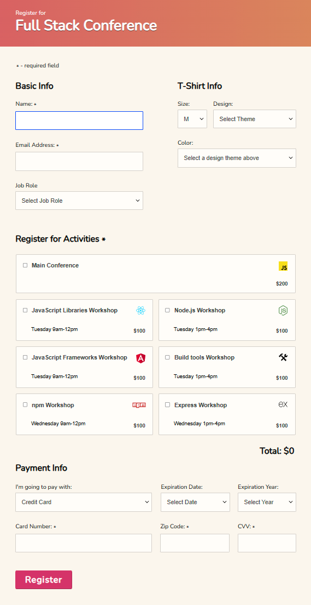

# P3_InteractiveForm

## Treehouse Tech Degree - Project 3 - Interactive Form

### Project Overview

In this project, you'll use JavaScript to enhance an interactive registration form for a fictional Full Stack conference. The goal is to make the form more user-friendly by implementing dynamic behaviors and validating user inputs.

### Key Features

- **Dynamic Behavior**: Add customized and conditional behavior to form elements based on user interactions.
- **Input Validation**: Ensure all user input is valid, and provide clear and helpful error messages when it's not.

### Technologies Used

- HTML
- CSS
- JavaScript

### Form Behavior Enhancements

1. **Conditional Logic**: Show or hide form elements based on selections in other parts of the form (e.g., payment options).
2. **Enhanced Accessibility**: Improve form accessibility by adding keyboard navigation enhancements and visual cues for focus states.

### Input Validation Details

- **Real-time Validation**: Check the validity of email addresses, credit card information, and other fields as the user types.
- **Error Messaging**: Display error messages to the relevant input fields if the entered data fails validation checks.

### View Live Form

[Try out the Interactive Form](https://sallen1851.github.io/P3_InteractiveForm/)

### Preview of the Interactive Form

### How to Use

1. **Download the project**: Clone the repository to your local machine.
2. **Open `index.html`**: Launch the form in any modern web browser to see it in action.
3. **Interact with the form**: Fill out fields, select options, and observe the real-time feedback provided by the JavaScript.

---

Thank you for checking out the Interactive Form project. Your feedback and contributions are appreciated!
